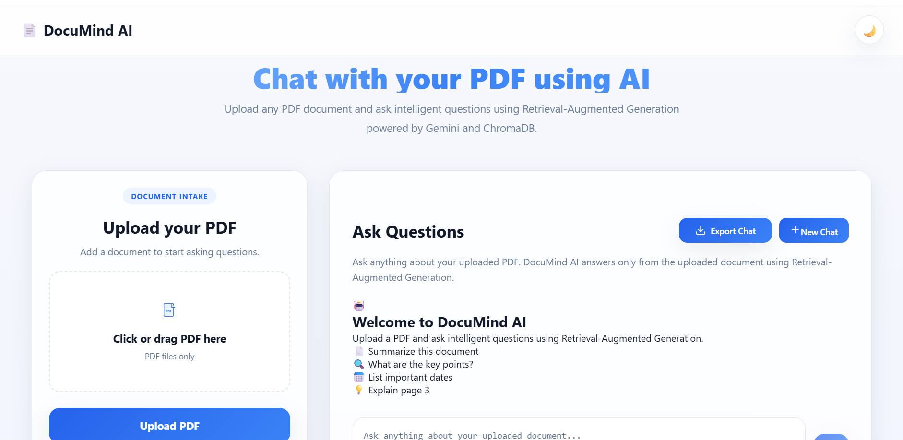
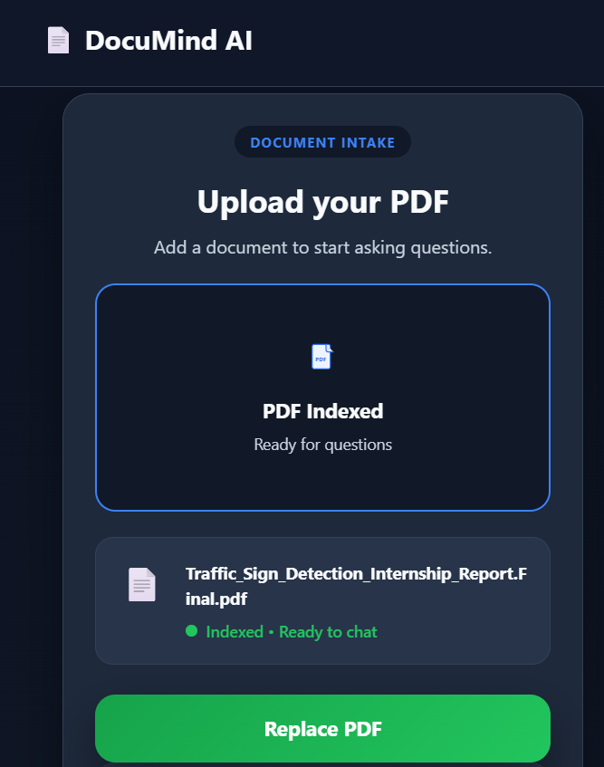
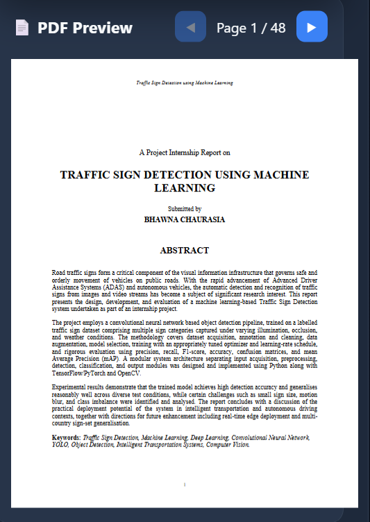
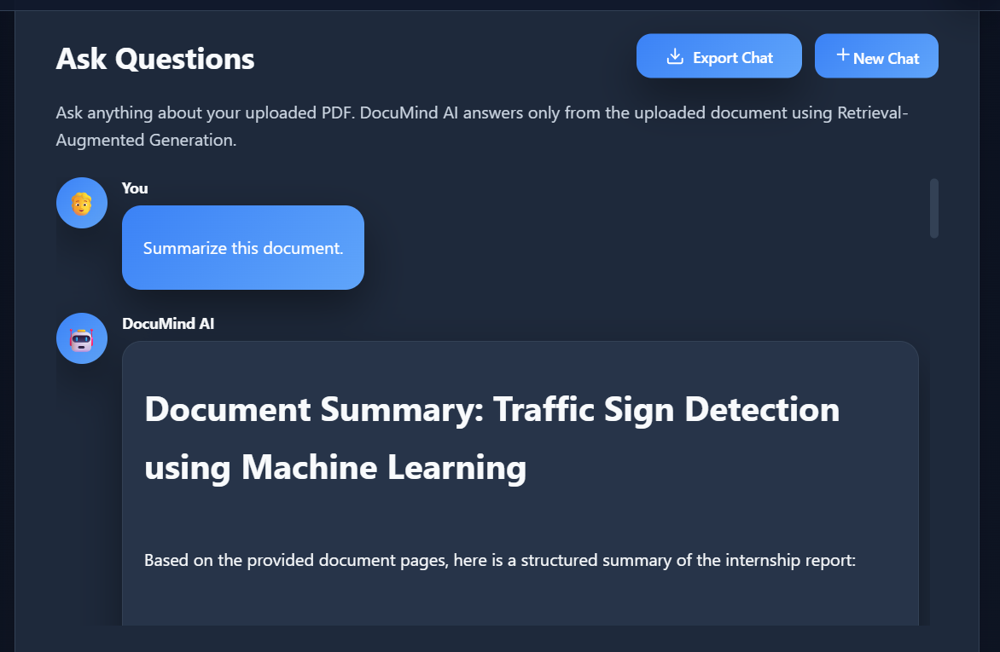
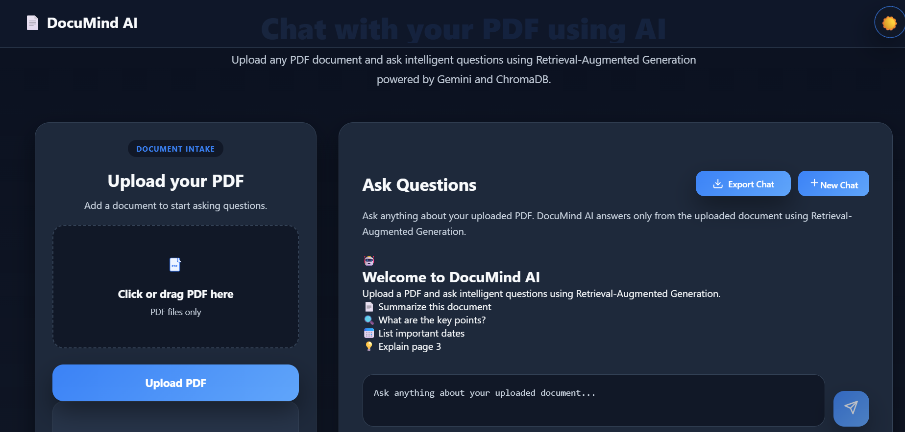

# 📄 DocuMind AI – Intelligent PDF Chat Assistant

<div align="center">


### Chat with your PDF using Retrieval-Augmented Generation (RAG) powered by Google Gemini and ChromaDB.

🌐 **Live Demo:** https://docu-mind-ai-rosy.vercel.app/

</div>

---

# 📌 Overview

DocuMind AI is a full-stack AI-powered document assistant that enables users to upload PDF documents and interact with them through natural language.

Instead of searching manually, users can ask questions, request summaries, and retrieve specific information from their uploaded documents. The application uses **Retrieval-Augmented Generation (RAG)** to ensure responses are grounded in the document content rather than relying solely on the language model.

---

# ✨ Features

- 📄 Upload PDF documents
- 🤖 AI-powered question answering using Google Gemini
- 🔍 Semantic search using ChromaDB vector database
- 🧠 Conversation memory for contextual follow-up questions
- 📑 Source page references for answers
- 📖 Built-in PDF preview
- 🌙 Light & Dark mode
- 🔊 Read Aloud (Text-to-Speech)
- 📤 Export chat history
- 💬 Modern chat interface
- 📱 Responsive design
- ☁️ Deployed on Vercel and Render

---

# 🏗️ System Architecture

```text
                User
                  │
                  ▼
        React + Vite Frontend
                  │
        Axios HTTP Requests
                  │
                  ▼
        FastAPI Backend (Render)
                  │
      ┌───────────┴───────────┐
      │                       │
      ▼                       ▼
 Google Gemini API      ChromaDB Vector Store
      │                       │
      └───────────┬───────────┘
                  ▼
           AI Generated Answer
```

---

# ⚙️ Tech Stack

## Frontend

- React.js
- Vite
- Axios
- React Markdown
- React PDF
- CSS3

## Backend

- FastAPI
- Python
- Google Gemini API (`google-genai`)
- ChromaDB
- PyMuPDF
- Uvicorn

## Deployment

- Frontend → Vercel
- Backend → Render

---

# 🧠 How It Works

## 1. Upload PDF

The uploaded PDF is processed using **PyMuPDF**, which extracts the document text page by page.

---

## 2. Text Chunking

The extracted text is divided into manageable chunks while preserving page information.

---

## 3. Embedding Generation

Each chunk is converted into a vector embedding using Google's **Gemini Embedding Model**.

---

## 4. Vector Storage

The embeddings are stored in **ChromaDB** together with metadata including:

- Page Number
- Chunk ID
- Source Document

---

## 5. User Query

When the user asks a question:

- The question is embedded
- ChromaDB retrieves the most relevant chunks
- Those chunks are passed to Gemini as context

---

## 6. Response Generation

Gemini generates an answer **strictly using the retrieved document context**, reducing hallucinations through Retrieval-Augmented Generation (RAG).

---

# 📂 Project Structure

```text
DocuMindAI
│
├── backend
│   ├── app
│   │   ├── routers
│   │   ├── services
│   │   ├── models
│   │   └── main.py
│   ├── uploads
│   ├── chroma_db
│   └── requirements.txt
│
├── frontend
│   ├── src
│   │   ├── components
│   │   ├── pages
│   │   ├── services
│   │   └── assets
│   └── package.json
│
└── README.md
```

---

# 🚀 Installation

## Clone the repository

```bash
git clone https://github.com/Bhawna-codeX/DocuMindAI.git

cd DocuMindAI
```

---

## Backend Setup

```bash
cd backend

python -m venv venv

venv\Scripts\activate

pip install -r requirements.txt

uvicorn app.main:app --reload
```

---

## Frontend Setup

```bash
cd frontend

npm install

npm run dev
```

---

# 🔑 Environment Variables

Create a `.env` file inside the **backend** directory.

```env
GEMINI_API_KEY=YOUR_API_KEY
```

---

# 🌍 Deployment

## Frontend

**Vercel**

https://vercel.com

---

## Backend

**Render**

https://render.com

---

# 📸 Screenshots

## 🏠 Home Page

<p align="center">
  
</p>

---

## 📄 Upload PDF

<p align="center">
  
</p>

---

## 📖 PDF Preview

<p align="center">
  
</p>

---

## 💬 AI Chat

<p align="center">
  
</p>

---

## 🌙 Dark Mode

<p align="center">
  
</p>

# 🎯 Future Enhancements

- Multiple PDF support
- User authentication
- OCR support for scanned PDFs
- Citation preview navigation
- Cloud document storage
- Chat history persistence
- Docker support
- CI/CD pipeline

---

# 📚 Key Concepts Used

- Retrieval-Augmented Generation (RAG)
- Vector Embeddings
- Semantic Search
- Prompt Engineering
- FastAPI REST APIs
- React State Management
- PDF Processing
- ChromaDB Vector Database
- Google Gemini API

---

# 👩‍💻 Author

**BHAWNA CHAURASIA**

GitHub: https://github.com/Bhawna-codeX

LinkedIn: https://linkedin.com/in/bhawna-chaurasia-b4aa53285 

---

# ⭐ Support

If you found this project useful, consider giving it a ⭐ on GitHub!